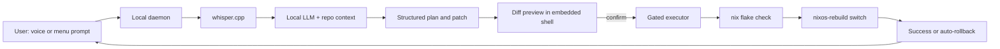

# LatheOS — Portable vibe coding OS on a USB

LatheOS is a **single USB stick** that behaves as:

1. **A bootable OS** — plug it into any PC / Mac, boot from USB, land in LatheOS.
2. **A virtual machine image** — on a host you don't want to reboot, open a small launcher that boots the same USB inside a window.
3. **A portable code vault** — your projects live on a partition that Windows, macOS and Linux can all read **without** booting LatheOS.
4. **A secure secret vault** — API keys, SSH keys, `.env` files, tokens. Encrypted with `age`; the decryption key lives on the Linux-only partition, so the stick is portable but the secrets are physically unreadable from a host OS.

All AI features (repair, coding assistance, voice) run **locally** on the USB, so even if the OS breaks its own networking, the agent can still fix it.

---

## 1. Physical layout of the USB

One stick, three partitions:

| # | Size | FS | Label | Purpose | Cross-OS? |
|---|------|----|-------|---------|-----------|
| 1 | ~1 GiB | FAT32 | `ESP` | EFI boot (+ launchers for Win/Mac/Linux) | Yes (readable) |
| 2 | **32 GiB** | ext4 | `latheos` | NixOS root + `/persist` (writable) | Linux only |
| 3 | **remainder** | exFAT | `LATHE_ASSETS` | Models + your projects + secrets vault | **Yes — all 3 OSes** |

The 32 GiB root gives plenty of headroom for multiple NixOS generations + cached store without stealing user space. On a 1 TB stick that still leaves ~960 GB for models + projects.

- Current code already models partitions 2 and 3 in `modules/storage.nix`.
- Partition **1** will also hold a small **host-side launcher** (see §3) so double-clicking on the USB from Windows/Mac starts the VM.
- Recommend **USB 3.2 Gen1 / USB-C**, ≥ **128 GB** (OS ~20 GB, local model 5–15 GB, rest for code).

---

## 2. Mode A — Boot LatheOS directly

Default and most responsive path.

- Reboot target machine with the USB inserted, pick it in the firmware boot menu.
- Root is **ext4 on the USB**; writes go there (with `/persist` for secrets and state).
- Changes stay on the USB. Move to another machine → resume where you left off.

**Awareness / caveats**

- **Firmware quirks**: Macs need option-boot; some OEM PCs need Secure Boot off.
- **Hardware drivers**: NixOS handles most modern hardware, but Apple Silicon (M-series) Macs **cannot** boot a generic Linux USB; they’d need Asahi or stay in Mode B.
- **USB wear**: Root on ext4 + `noatime` already; consider `commit=60` tweak later.

---

## 3. Mode B — Run LatheOS as a VM *on top of* the host OS

Same USB, but you stay in macOS / Windows / Linux and just open a window.

### How it works

- The exFAT partition ships a **launcher folder** (e.g. `LATHE_ASSETS/launcher/`) with **per-host** scripts + README:
  - **macOS**: invoke **QEMU** (Intel) or **UTM/Virtualization.framework** (Apple Silicon) against the raw USB block device **or** a bundled `disk.qcow2`.
  - **Windows**: invoke **QEMU for Windows** (bundled) pointing at the USB.
  - **Linux**: invoke **QEMU/KVM** from the system packages.
- The VM treats the **same USB** as its disk, so your work is identical whether you booted or VM-ed.

### Constraints to accept up front

- **You must install a hypervisor on the host first** (QEMU/UTM/VirtualBox). We can bundle **QEMU binaries** for Windows and maybe macOS-Intel, but macOS Apple Silicon needs the user to install UTM (free, App Store). That’s unavoidable — Apple does not let us ship a signed kernel extension on a USB.
- **Apple Silicon** VM will run **aarch64 LatheOS**, not x86. Our flake already builds both; the **local LLM** must have an aarch64 variant too.
- **Performance**: VM mode is slower than boot mode, and raw-USB access through a VM is slower than a cloned image. Expect “fine for editing and local LLM at 7B; sluggish at 30B+.”
- **Licensing**: QEMU is GPLv2 — redistributable. VMware/Parallels are not. We only ship QEMU.

---

## 4. Local-first AI (the repair brain lives on the USB)

Rationale you already identified: **if the OS breaks its own Wi-Fi, a cloud LLM can’t repair it**. So:

### 4.1 Components to run on the USB

| Layer | Tool | Size-ish | Notes |
|-------|------|---------|-------|
| Wake word | **Picovoice / Porcupine** (already present) | < 10 MB | Works offline. |
| STT (speech→text) | **whisper.cpp** (`base.en` → `small.en`) | 150–500 MB | CPU-capable, fast enough for short commands. |
| LLM runtime | **Ollama** (localhost:11434, loopback only) | < 100 MB binary | Hosts both models below. |
| **Voice / fast model** | **Llama 3.2 3B Instruct** (Meta, US) | ~2 GB q4 | Handles the live voice loop — quick, low-RAM, conversational. |
| **Heavy / code model** | **Codestral 22B** (Mistral, France) *default*; **Llama 3.1 8B Instruct** (Meta) *low-RAM fallback* | ~13 GB / ~5 GB q4 | Background worker: code edits, nix-patch suggestions, multi-file reasoning. |
| TTS (text→speech) | **Piper** (offline) | 20–100 MB | Replaces Cartesia in offline mode. |

**Origin policy:** Chinese-origin models (DeepSeek, Qwen, Yi, etc.) are excluded by product rule. Defaults above are Meta (US) and Mistral (France). Users can override via `/persist/secrets/llm.env` at their own discretion.

### 4.1.1 Auto-selected heavy model (RAM-aware)

The `cam-llm-autoselect` systemd unit runs on every boot, reads `/proc/meminfo`, and writes the chosen heavy model into `/run/latheos/heavy-model.env`:

| Detected total RAM | Heavy model picked |
|---------------------|--------------------|
| ≥ **20 GB** | **Codestral 22B** |
| < 20 GB | **Llama 3.1 8B** |

This means the same USB behaves correctly on an 8 GB laptop *and* on a 32 GB workstation — no manual intervention.

### 4.1.2 Multi-agent pool (parallel, Claude-Code-like)

For any non-trivial request the daemon does **not** send one giant prompt. Instead it runs the pool in `daemon/cam_daemon/agents.py`:

```
Dispatcher (voice model, fast) — reads user intent, returns ≤ 4 sub-tasks.
    ├── Planner (heavy)   — stepwise plan
    ├── Coder (heavy)     — code / unified diff
    ├── Critic (heavy)    — safety + reversibility check
    └── Speaker (voice)   — short spoken summary (≤ 3 sentences)
```

All workers run **in parallel** against the local Ollama HTTP API. Tune the parallelism via `LATHEOS_MAX_AGENTS` in `/etc/latheos/llm.env` (default `4`). Adding a new specialist = adding one entry to `AGENT_ROLES` — no other code changes.

### 4.1.3 Language support

Primary `en`, secondary `ko`. The greeter + daemon read `LATHEOS_LANG` and switch both prompt text and Piper voice file accordingly. Extra languages = drop a new `*.onnx` into `/assets/models/piper/` and set `LATHEOS_PIPER_VOICE` to its path.

Defaults shipped: `en_US-amy-medium.onnx` (English) and `ko_KR-kss-medium.onnx` (Korean).

### 4.2 Where they live on disk

- **Binaries**: built through Nix, part of the root FS — versioned with the flake.
- **Weights**: **NOT** in the Nix store (too big, changes too often). Stored on the **exFAT** partition under `LATHE_ASSETS/models/`. The daemon reads them through a config path.
- **Cache**: `/persist/cache/llm/` for k/v cache, prompts, tokenizers.

### 4.3 Cloud becomes optional

The existing **CAM Cloud Proxy** doesn’t go away — it becomes an **upgrade path** when the user explicitly turns it on (bigger models, streaming STT/TTS). Offline stays the default.

---

## 4.4 Login experience — CAM welcome briefing (Jarvis-style)

When the graphical session starts, a user-level systemd unit (`cam-greeter`) runs **once** and:

1. Collects a **system status snapshot**: battery, free disk on `/assets`, free memory, network reachability, Ollama health, `/persist/state/session.json` (last task + open to-dos).
2. Hands the snapshot to the **voice model** (Llama 3.2 3B) with a short prompt asking for a ≤ 3-sentence briefing.
3. Speaks the result through **Piper** (offline TTS) and simultaneously pops a desktop notification so the user can read it.
4. Writes `last_boot` back into the session state.

If Ollama hasn't finished pulling models yet (very first boot, offline), the greeter falls back to a templated sentence so login is never blocked.

Users can see / edit the persistent state file at:

```
/persist/state/session.json
```

…which survives `nixos-rebuild` because it lives in `/persist`. Schema:

```json
{
  "last_task": "…",
  "todos": ["…", "…"],
  "last_boot": "2026-04-20T08:12:00Z"
}
```

Future work: let voice commands append to `todos` (`"CAM, remind me to X"`), and let the daemon auto-write `last_task` when a voice session closes.

---

## 5. Self-repair loop (end-to-end)



Safety rules (non-negotiable):

1. **Dry-run first** (`nix flake check`, `nixos-rebuild build`) before **any** `switch`.
2. **Boot generation kept** — NixOS already lets you pick the previous generation from the boot menu if the new one can’t boot.
3. **Allowlist** the executor: only specific commands and specific file roots (`/etc/nixos`, `/persist/projects`, `LATHE_ASSETS/projects`).
4. **No secret leakage** — redact `/persist/secrets/**` before anything goes into an LLM prompt.

---

## 6. Embedded coding surface (inside LatheOS)

We do **not** try to embed Cursor. We build a minimal integrated shell that the voice agent and menu can drop the user into:

- **Window**: one Sway-managed GTK/WebKit window.
- **Editor**: Monaco (or CodeMirror 6) — file tree, tabs, LSP.
- **Terminal tab**: xterm.js attached to a login shell.
- **Chat strip**: always-on side panel connected to the local LLM; voice output piped through Piper.
- **Diff view**: used every time repair is proposed.

Heavier option later: optional **code-server** or **Cursor** in Sway as a second surface; not the default.

---

## 7. Build & ship pipeline (adjusted)

1. `nix build .#latheos-usb-image` — new target, produces a **raw disk image** with all 3 partitions prepopulated (ESP + ext4 + exFAT stub).
2. A second command bundles the image into a **ZIP** with the **host-side launchers** (Win / Mac / Linux) and a README, so an end user literally:
   - Flashes the raw image onto a USB stick (balenaEtcher / Rufus / `dd`), **or**
   - Copies the ZIP contents onto the exFAT partition of an already-provisioned stick and runs `launcher-<os>` to VM-boot.
3. First boot on a real machine (or VM) runs a one-shot setup: user password, model download prompt, optional cloud token.

---

## 8. Locked decisions (as of this iteration)

| Topic | Decision |
|-------|----------|
| First target host | **Windows (x64)** laptop + desktop. |
| USB size | **User-configurable**; 512 GB minimum recommended, 1 TB+ expected. |
| Mode priority | **Mode A (boot from USB) first**, Mode B (VM) as fallback. |
| Mode B on Windows | **Double-click and go** — portable QEMU bundled under `launcher/windows/qemu/`. |
| Primary interaction | **Voice** (local wake word → local STT → local LLM → local TTS). Text chat always available. |
| Models | Two: **Llama 3.2 3B** (voice) + **Codestral 22B** (heavy); **Llama 3.1 8B** as low-RAM override. |
| Model origin policy | **No Chinese-origin models** in defaults. |
| Cloud proxy | **Optional toggle** via `CAM_PROXY_URL`. Blank by default = fully offline. |
| `/assets` sizing | ext4 root pinned at **32 GiB**; the rest of the USB is exFAT `/assets`. |
| VM disk strategy (Mode B) | **Raw USB passthrough** (same bytes as Mode A) so state is continuous across modes. |
| Login briefing | **`cam-greeter`** user unit speaks a short status + last-task briefing on each login. |
| Wake word | **Picovoice Porcupine** — user pastes the key into `/persist/secrets/cam.env` when approved. |
| Licensing | QEMU (GPLv2) bundled is OK; model weights pulled by the user, not redistributed by us. |

## 9. Remaining open questions for the next iteration

1. **Hardware target for first real boot** — is there a specific Windows laptop / PC I should assume (CPU, RAM, GPU)? That tells me whether 22B is realistic or if we should default to 8B.
2. **Wake word choice** — keep Picovoice / Porcupine (proprietary, free personal tier) or swap to an open alternative (OpenWakeWord, snowboy-community)? Today the daemon still assumes Porcupine.
3. **`/assets` size guidance** — how big should the exFAT partition be by default? Model weights + user projects will share it.
4. **VM disk strategy** — give QEMU the **raw USB** (`\\.\PhysicalDrive`N, same bytes as Mode A — safest for state continuity) or an **image file** on the exFAT partition (easier to snapshot, but diverges from Mode A)?
5. **UI language / accent for Piper** — default is `en_US-amy-medium`; if you want something else I'll swap the default path.
6. **Do you want a “safe mode”** boot option (previous NixOS generation, no LLM auto-pull, no cam-daemon) already in v1, or is that Phase-2?

---

## 9a. Secret vault (product identity)

See `modules/vault.nix`. Design highlights:

- **Storage split** — encrypted blob on exFAT (`/assets/vault/secrets.age`, visible to every OS), private key on ext4 (`/persist/secrets/vault.key`, invisible to Windows/macOS).
- **CLI** — `vault set|get|list|export|unlock-env|mark-auto|rm|pubkey`.
- **Auto-inject** — entries tagged `auto:true` are evaluated into every new shell via `shellInit`, so API keys become env vars without leaving plaintext on disk.
- **Threat model** — strong against a curious host OS with physical USB plugged in; weak against root on a host that can forensically image ext4. Follow-up: optional LUKS layer on the ext4 partition.

## 9b. Release pipeline

See `.github/workflows/release.yml` + `scripts/build-usb-image.sh`.

1. Tag push `v*` (or manual dispatch) triggers the `release` workflow on ubuntu-24.04.
2. Nix builds the system closure, a Linux host toolchain (parted, mkfs.ext4, mkfs.exfat, etc.) assembles the 3-partition raw image.
3. `nixos-install` populates the ext4 root; launchers + installers get seeded onto the exFAT partition.
4. `zip` produces `latheos-usb.zip` containing:
   - `latheos-usb.img` + checksum
   - `installer/{windows,linux,macos}/`
   - `launcher/{windows,linux,macos}/`
   - `README.md` (user-facing, top-level)
5. The release action attaches the zip to the GitHub Release for public download.

Locally (Linux / WSL2): `make release`.

## 10. Where this lives in the repo (updated)

- Partitions + `/assets`: `modules/storage.nix`
- Desktop / menu: `modules/sway.nix`
- Voice + WS + executor: `daemon/cam_daemon/`, `modules/cam-daemon.nix` *(env updated — cloud proxy now opt-in)*
- **Local AI runtime:** `modules/local-llm.nix` *(new — Ollama + whisper + piper + first-boot model pull)*
- **Embedded shell scaffold:** `modules/embedded-shell.nix` *(new — WebKitGTK runtime deps, `lathe` CLI stub, desktop entry)*
- **Login briefing:** `modules/greeter.nix` *(reads `/persist/state/session.json`, speaks via Piper, en + ko prompts)*
- **Multi-agent pool:** `daemon/cam_daemon/agents.py` *(Dispatcher → parallel Workers → Speaker on local Ollama)*
- **Secret vault:** `modules/vault.nix` *(age-encrypted, cross-platform-visible, LatheOS-only-decryptable)*
- **RAM-aware model pick:** `cam-llm-autoselect` unit in `modules/local-llm.nix`
- **First-run profile apply:** `cam-firstrun-apply` unit in `modules/local-llm.nix`
- **USB image build:** `scripts/build-usb-image.sh` *(real: parted + losetup + nixos-install + zip bundle)*
- **Release workflow:** `.github/workflows/release.yml` *(tag push → builds the image → attaches zip to GitHub Release)*
- **User-facing README:** `RELEASE_README.md` *(shipped inside `latheos-usb.zip` as `README.md`)*
- **Pre-boot installers (one per host OS):**
  - `installer/windows/Install-LatheOS.ps1` + README
  - `installer/linux/install-latheos.sh`
  - `installer/macos/install-latheos.command`
- **Host-side launchers (Mode B):**
  - `launcher/windows/Launch-LatheOS.bat` — portable QEMU, WHPX accel.
  - `launcher/linux/launch-latheos.sh` — KVM, auto-detects USB by label.
  - `launcher/macos/launch-latheos.command` — Hypervisor.framework (hvf); x86 on Intel Macs, aarch64 on Apple Silicon.

### What still needs to be written (next step)

- Real raw-image assembler in `scripts/build-usb-image.sh` (currently a scaffold).
- Daemon refactor to call `http://127.0.0.1:11434` (voice model) and dispatch heavy requests in the background (heavy model).
- `platform/embedded-shell/` actual source (WebKitGTK + Monaco + xterm.js + chat bar).
- `launcher/linux/` and `launcher/macos/` scripts.
