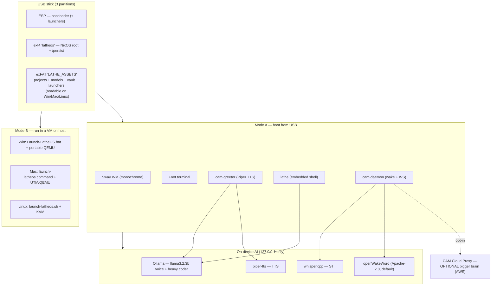
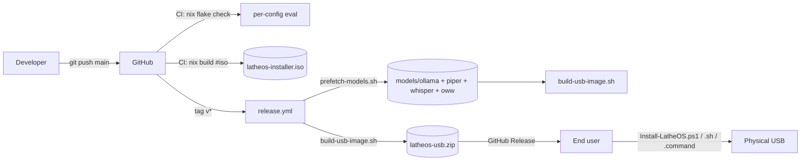

# LatheOS — plan, status, and open blockers

> One page, read top-to-bottom. Detailed subsystem docs are in the other
> files in this folder; this one exists to answer "where are we, what's
> still missing, and what's next?" without re-reading everything.

## 1. One-paragraph pitch

LatheOS is a **portable, offline-first vibe-coding OS** that lives on a USB
stick. Plug it in, pick it in your boot menu, and you land on a monochrome
Sway desktop whose flagship app is `lathe` — a Jarvis-style ASCII HUD that
shows your machine's real components (brand, model, condition), streams
commentary from a local LLM, and lets you run code and shell commands in
the same window. All AI runs on the stick; the cloud proxy is an optional
"bigger brain" upgrade, not a dependency.

## 2. Architecture at a glance



## 3. What the user sees

```
┌──────────────────────── LatheOS · lathe 0.1 ────────────────────────┐
│ ┌─ HUD · live ─────────────┐ ┌─ CAM · voice model ─────────────────┐ │
│ │ CPU   ▓▓▓▓▓▓░░░  62.4 %  │ │ CAM> Welcome back. Systems online;  │ │
│ │ RAM   ▓▓▓▓░░░░░  41.2 %  │ │      disk 78G free; battery 92%.    │ │
│ │ GPU   ▓▓░░░░░░░  18.0 %  │ │ you> check the flake                │ │
│ │ NVMe  ░░░░░░░░░   6.3 %  │ │ CAM> running `nix flake check` …    │ │
│ │ BAT   ▓▓▓▓▓▓▓▓░  92.0 %  │ │                                     │ │
│ └──────────────────────────┘ └─────────────────────────────────────┘ │
│ ┌─ components · detected ──┐ ┌─ terminal · one-shot ───────────────┐ │
│ │ [AMD   ] Ryzen 7 7840HS  │ │ $ nix flake check                   │ │
│ │    .----------------.    │ │ warning: unreferenced input ...     │ │
│ │   /                 /|   │ │ exit 0                              │ │
│ │  +------------------+|   │ │                                     │ │
│ │  |  DIE  [::]       ||   │ │                                     │ │
│ │ ● OK                     │ │                                     │ │
│ │ [HYNIX ] HMA81GR7...     │ │                                     │ │
│ │ ● OK                     │ │                                     │ │
│ │ ...                      │ │                                     │ │
│ └──────────────────────────┘ └─────────────────────────────────────┘ │
│  F1 help · F2 color · F3 detail · F10 quit                           │
└──────────────────────────────────────────────────────────────────────┘
```

The same binary, with `--color`, shades CPU/RAM/GPU bars green/yellow/red
based on utilisation, and colours the brand tags. With `--detail`, each
component plate swaps for an exploded-schematic ASCII block.

## 4. Status matrix — what's built, what's next

| Area | Status | Evidence |
|---|---|---|
| NixOS flake (x86_64 + aarch64) | ✅ built | `flake.nix`, `configuration.nix` |
| Sway monochrome + $mod+o bind | ✅ built | `modules/sway.nix` |
| PipeWire low-latency audio | ✅ built | `modules/audio.nix` |
| Storage layout (ESP/ext4/exFAT) | ✅ built | `modules/storage.nix` |
| cam-daemon (wake + WS + exec) | ✅ built | `daemon/cam_daemon/` |
| Wake-word multi-backend | ✅ built | `wake.py` supports oww / porcupine / clap / PTT |
| **Embedded shell (`lathe`)** | ✅ **newly built** | `platform/embedded-shell/` full Textual app |
| **ASCII hardware HUD** | ✅ **newly built** | `lathe_shell/hud.py` + `components_pane.py` |
| **ASCII-3D component plates** | ✅ **newly built** | `lathe_shell/ascii_art.py` (compact + detailed) |
| **Brand/model detection** | ✅ **newly built** | `lathe_shell/hardware.py` (lspci, dmidecode, sysfs) |
| **Color vs. monochrome toggle** | ✅ **newly built** | F2 in the app, `--color` flag |
| **Detail toggle** | ✅ **newly built** | F3 in the app, `--detail` flag |
| Local-first LLM stack | ✅ built | `modules/local-llm.nix` |
| **Offline models baked into image** | ✅ **newly built** | `scripts/prefetch-models.sh` + build-usb-image.sh hook |
| Piper TTS voices (en+ko) on /assets | ✅ **newly built** | prefetch script downloads them |
| Whisper base.en on /assets | ✅ **newly built** | prefetch script downloads it |
| openWakeWord ONNX models on /assets | ✅ **newly built** | prefetch + cam-daemon.nix pull them |
| Greeter ("Jarvis briefing") | ✅ built | `modules/greeter.nix` |
| Secret vault (age, split keys) | ✅ built | `modules/vault.nix` |
| Multi-agent pool | ✅ built | `daemon/cam_daemon/agents.py` |
| Windows installer (+wake toggle) | ✅ **updated** | `installer/windows/Install-LatheOS.ps1` |
| Linux installer (+wake toggle) | ✅ **updated** | `installer/linux/install-latheos.sh` |
| macOS installer (+wake toggle) | ✅ **updated** | `installer/macos/install-latheos.command` |
| VM launchers (Win/Linux/macOS) | ✅ built | `launcher/` |
| USB image assembler | ✅ **updated** | `scripts/build-usb-image.sh` now seeds models |
| Release CI workflow | ✅ **updated** | `.github/workflows/release.yml` runs prefetch |
| Diff review UI (self-repair) | ⏳ next | planned widget in `lathe_shell/diff_pane.py` |
| Monaco editor surface | ⏳ later | `platform/embedded-shell/` TUI first; GUI after |
| Real PTY in the terminal pane | ⏳ later | v1 is one-shot; `ptyprocess` widget later |
| Actual end-to-end USB build | ❌ needs Linux/CI | can't run from Windows; CI/WSL required |

## 5. First-boot flow (what happens when a user plugs in the new stick)

```
power on → firmware boots ESP →
  Sway starts on tty1 (greetd + tuigreet) →
    cam-greeter.service:
      - reads /persist/state/session.json
      - checks disk, RAM, battery, Ollama
      - if models pre-baked (.prefetched) → greet immediately
      - else → templated "Welcome back" + models pull in background
      - speaks via Piper if voice file present
    cam-daemon.service:
      - opens mic via PipeWire
      - LATHEOS_WAKE_BACKEND=oww → openWakeWord loads from /assets/models/openwakeword
      - OR LATHEOS_WAKE_BACKEND=porcupine + PICOVOICE_ACCESS_KEY → Porcupine
      - OR neither present → clap + control-socket only
      - control socket listens for camctl / $mod+space PTT
  user types $mod+o → foot opens lathe → HUD + components + chat + terminal
```

## 6. Build + ship pipeline (current)



## 7. What you (human) still need to decide / obtain

See `§8 — Blockers beyond Picovoice` below.

## 8. Blockers beyond Picovoice

**None of these block the first bootable USB build.** They're quality-of-life upgrades.

1. **A Linux builder** (native or WSL2, with Nix ≥ 2.18 + root).
   The `build-usb-image.sh` script uses `mkfs.ext4` + `mkfs.exfat` +
   `losetup` — Windows cannot do those natively. Options:
   - Install WSL2 Ubuntu, run `make release`.
   - Trust the CI pipeline — tag a `v*`, wait for the release.
   - Spin up an Ubuntu VM/EC2 once just for the build (then shut it down).

2. **A domain + AWS account** — **only if you want the cloud upgrade**.
   Local-first mode needs neither. If you ever want `CAM_PROXY_URL` set to
   a real hostname for bigger models, then you need the `SETUP.md` §1-§4
   steps (Route53 + ACM + Terraform + ECR push).

3. **An Ollama host with enough disk** for the prefetch step:
   - Voice model (`llama3.2:3b`) ~2 GB
   - Small heavy (`llama3.1:8b`) ~5 GB
   - Big heavy (`codestral:22b`) ~13 GB
   - Total bake: ~7 GB default, ~22 GB with `HEAVY=big`.

4. **USB stick sizing**:
   - ≥ 32 GB to boot at all
   - ≥ 64 GB for voice + small heavy prebaked
   - ≥ 128 GB if you want codestral prebaked + headroom for projects

5. **Model licence sanity check**. Redistributing model weights inside a
   GitHub Release zip is allowed for llama.cpp/Piper/Whisper bundles, but
   the **Ollama model blobs are large (~GB)** and pulling them via the
   prefetch step during CI is fine. Shipping them inside a public release
   asset has a practical cap of 2 GB per file on GitHub; we work around
   this because the Ollama blob layout is many <2 GB shard files. No
   action needed — flagged only so you understand why we keep the
   per-model pull separate instead of one giant tar.

6. **openWakeWord wake phrase**. The Apache-2.0 pretrained bundle only
   ships "hey_jarvis", "alexa", and a few others — not "hey cam". If you
   want the literal phrase "hey cam", we need to train a custom 50 KB
   ONNX model (takes ~30 min with their training notebook). Until then
   the default wake phrase is **"hey jarvis"**, which arguably matches
   the product aesthetic better anyway.

7. **CAM_Cloud_Proxy repo** (sibling project): untouched by this change
   set. The pipeline above assumes local-first. If you later want the
   cloud path, the CAM side still needs the Terraform apply in the
   `CAM_Cloud_Proxy/` directory and a hardware token in DynamoDB.

## 9. How to try `lathe` without a full NixOS build

```bash
cd platform/embedded-shell
python -m venv .venv
. .venv/bin/activate            # (PowerShell: .\.venv\Scripts\Activate)
pip install -e .
lathe                           # monochrome
lathe --color --detail          # full palette + ASCII-3D plates
```

On Windows the hardware detector will show "unknown" for most fields (it's
a Linux-first module — `/proc`, `/sys`, `dmidecode`); the ASCII art, HUD
layout, and chat still render so you can iterate on UI without booting.
